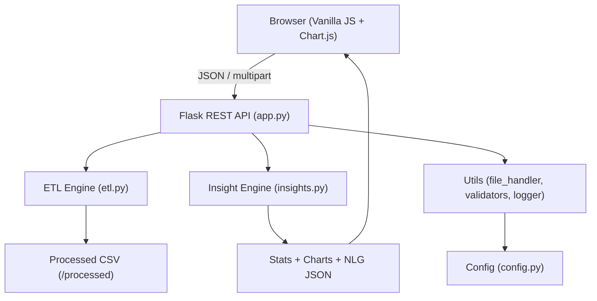

# SmartCSV – Automated ETL & Insight Generation Platform

A production-ready, full-stack web application that lets users upload CSV files, automatically performs robust ETL processing, generates comprehensive statistical and visual insights, and delivers AI-powered natural language summaries.

## Architecture



## Features

| Feature | Description |
|---------|-------------|
| **File Upload** | Drag-and-drop CSV upload with MIME/extension validation, encoding detection, and metadata extraction |
| **ETL Pipeline** | 9-step automated pipeline: column standardisation, deduplication, missing-value imputation (skew-aware), date conversion, IQR outlier detection, dtype optimisation, feature engineering |
| **Insight Engine** | Descriptive statistics, Pearson correlation with p-values, Freedman-Diaconis distribution binning, frequency tables |
| **Auto Chart Selection** | Intelligent chart type selection: line (time-series), bar, pie, histogram, scatter, correlation heatmap |
| **AI Summaries** | Template-based NLG engine producing human-readable insights about trends, correlations, and distributions |
| **Dark/Light Theme** | Premium glassmorphism UI with theme toggle and responsive mobile-first design |

## Tech Stack

| Layer | Technology |
|-------|------------|
| Backend | Python 3.11+, Flask, Pandas, NumPy, SciPy, Scikit-learn |
| Frontend | HTML5, CSS3, Vanilla JavaScript, Axios, Chart.js |
| DevOps | Docker, Gunicorn |

## Project Structure

```
smartcsv/
├── app.py                  # Flask API (routes, error handlers)
├── etl.py                  # ETL pipeline (9 ordered transforms)
├── insights.py             # Stats, chart engine, NLG summaries
├── config.py               # Centralised configuration
├── utils/
│   ├── file_handler.py     # Upload save, CSV loading, encoding detection
│   ├── validators.py       # CSV validation, metadata extraction
│   └── logger.py           # Rotating file + console logging
├── templates/
│   └── index.html          # Single-page application
├── static/
│   ├── css/style.css       # Premium responsive design
│   └── js/script.js        # UI logic, Chart.js, Axios
├── requirements.txt
├── Dockerfile
└── README.md
```

## Quick Start

### Local Development

```bash
# 1. Create virtual environment
python -m venv venv

# 2. Activate (Windows)
venv\Scripts\activate
# Or (Linux/macOS)
source venv/bin/activate

# 3. Install dependencies
pip install -r requirements.txt

# 4. Run the application
python app.py
```

Open [http://localhost:5000](http://localhost:5000) in your browser.

### Docker

```bash
docker build -t smartcsv .
docker run -p 5000:5000 smartcsv
```

### Production Deployment (Render)

The Included `render.yaml` makes deployment easy:

1. Push this repository to GitHub/GitLab.
2. Create a new Web Service on Render.
3. Connect your repository.
4. Render will automatically detect the `render.yaml` and configure the service.
5. Add a `SECRET_KEY` environment variable in the dashboard (or let Render generate one).

**Note:** The filesystem on Render is ephemeral. Uploaded files will be deleted when the service restarts. For persistent storage, configure an AWS S3 bucket or similar service.

### Manual Production Run (Gunicorn)

```bash
gunicorn --bind 0.0.0.0:5000 --workers 2 --timeout 120 app:app
```

## API Documentation

### `POST /upload`

Upload a CSV file and receive metadata.

**Request:** `multipart/form-data` with field `file`

**Response (200):**
```json
{
    "filename": "20260212_143000_ab12cd34_data.csv",
    "row_count": 12345,
    "column_count": 12,
    "columns": ["col1", "col2"],
    "data_types": {"col1": "int64", "col2": "object"},
    "missing_values": {"col1": 0, "col2": 150},
    "duplicate_rows": 10,
    "size_kb": 2048.0,
    "warnings": []
}
```

### `POST /process`

Run the ETL pipeline on an uploaded file.

**Request Body:**
```json
{ "filename": "20260212_143000_ab12cd34_data.csv" }
```

**Response (200):**
```json
{
    "transformations_applied": ["removed_duplicates (10 rows)", "filled_missing_age_with_median (25 values)"],
    "outliers_detected": {"salary": 42},
    "rows_after": 12335,
    "columns_after": 15,
    "memory_reduction_mb": 2.5,
    "processed_file": "cleaned_20260212_143000_ab12cd34_data.csv"
}
```

### `GET /insights?file=cleaned_...`

Retrieve full statistical insights, chart configurations, and NLG summaries.

### `GET /download?file=cleaned_...`

Download the processed CSV file.

## Environment Variables

| Variable | Default | Description |
|----------|---------|-------------|
| `PORT` | `5000` | Server port |
| `FLASK_DEBUG` | `false` | Enable debug mode |
| `UPLOAD_FOLDER` | `./uploads` | Upload directory |
| `PROCESSED_FOLDER` | `./processed` | Processed files directory |
| `LOG_FOLDER` | `./logs` | Log files directory |
| `MAX_CONTENT_LENGTH` | `10485760` | Max upload size (bytes) |
| `LOG_LEVEL` | `INFO` | Logging level |
| `SECRET_KEY` | (set in config) | Flask secret key |

## License

MIT
