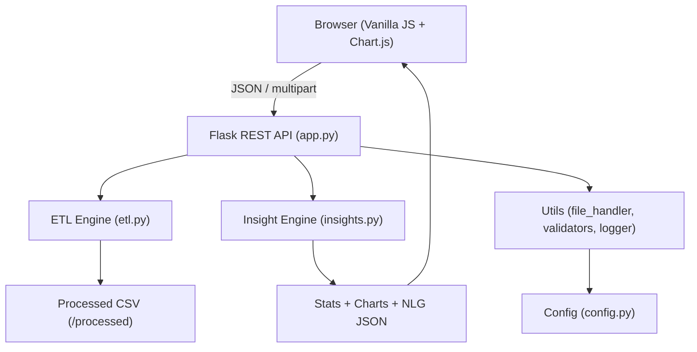

# SmartCSV – Automated ETL & Insight Generation Platform

<p align="center">
  
  
  
  
  
  
  <a href="https://smartcsv.vercel.app/"></a>
</p>

<p align="center">
  <strong>From raw CSV to actionable insights – automatically.</strong><br>
  SmartCSV is a production‑ready, full‑stack web application that ingests CSV files, runs a robust ETL pipeline, generates rich statistical and visual insights, and delivers AI‑powered natural language summaries.
</p>

---

## 🌐 Live Demo

Experience SmartCSV instantly without installation:  
👉 **[https://smartcsv.vercel.app/](https://smartcsv.vercel.app/)**

> **Note:** The demo runs on a serverless environment. Uploaded files are temporary and will be removed after processing.

---

## 📖 Table of Contents

- [Features](#-features)
- [Architecture](#-architecture)
- [Tech Stack](#-tech-stack)
- [Project Structure](#-project-structure)
- [Getting Started](#-getting-started)
  - [Prerequisites](#prerequisites)
  - [Local Development](#local-development)
  - [Docker](#docker)
  - [Production Deployment](#production-deployment)
- [Usage](#-usage)
- [API Documentation](#-api-documentation)
- [Environment Variables](#-environment-variables)
- [Contributing](#-contributing)
- [License](#-license)
- [Acknowledgments](#-acknowledgments)

---

## ✨ Features

| Area               | Capabilities |
|--------------------|--------------|
| **📁 Upload**      | Drag‑and‑drop UI, MIME/extension validation, encoding detection, metadata extraction (rows, columns, dtypes, missing values, duplicates). |
| **⚙️ ETL Pipeline**| 9‑step automated pipeline: column standardisation, deduplication, skew‑aware missing‑value imputation, date conversion, IQR outlier detection, dtype optimisation, feature engineering. |
| **📊 Insight Engine**| Descriptive statistics, Pearson correlation (with p‑values), Freedman‑Diaconis binning for histograms, frequency tables. |
| **📈 Auto Charting**| Intelligent chart selection: line (time‑series), bar, pie, histogram, scatter, correlation heatmap. Rendered client‑side with Chart.js. |
| **🧠 AI Summaries**| Template‑based natural language generation (NLG) that describes trends, correlations, and distributions in plain English. |
| **🎨 UI/UX**       | Premium glassmorphism design, responsive mobile‑first layout, dark/light theme toggle. |

---

## 🏗 Architecture


```mermaid
graph TD
    A["Browser (Vanilla JS + Chart.js)"] -->|JSON / multipart| B["Flask REST API (app.py)"]
    B --> C["ETL Engine (etl.py)"]
    B --> D["Insight Engine (insights.py)"]
    C --> E["Processed CSV (/processed)"]
    D --> F["Stats + Charts + NLG JSON"]
    F --> A
    B --> G["Utils (file_handler, validators, logger)"]
    G --> H["Config (config.py)"]
```

**Flow:**
1. User uploads a CSV → validated, saved with a timestamped unique name.
2. `/process` endpoint triggers the ETL pipeline → cleaned dataset stored.
3. `/insights` computes statistics, auto‑selects charts, and generates NLG summaries.
4. Frontend renders interactive charts and insight cards.

---

## 💻 Tech Stack

| Layer          | Technology                                                                 |
|----------------|----------------------------------------------------------------------------|
| **Backend**    | Python 3.11+, Flask, Pandas, NumPy, SciPy, Scikit‑learn                   |
| **Frontend**   | HTML5, CSS3, Vanilla JavaScript, Axios, Chart.js                          |
| **DevOps**     | Docker, Gunicorn                                                          |
| **Deployment** | Vercel (serverless), Render (PaaS)                                        |

---

## 📁 Project Structure

```
smartcsv/
├── app.py                  # Flask application, API routes, error handlers
├── etl.py                  # ETL pipeline – 9 ordered transformations
├── insights.py             # Statistics engine, chart config, NLG summaries
├── config.py               # Centralised configuration & environment vars
├── utils/
│   ├── file_handler.py     # Secure file saving, CSV loading, encoding detection
│   ├── validators.py       # CSV schema validation, metadata extraction
│   └── logger.py           # Rotating file + console logging
├── templates/
│   └── index.html          # Single‑page application (SPA) entry
├── static/
│   ├── css/style.css       # Premium responsive design, glassmorphism, theme
│   └── js/script.js        # UI logic, Chart.js rendering, Axios calls
├── requirements.txt        # Python dependencies
├── Dockerfile              # Containerised deployment
├── vercel.json             # Vercel serverless configuration
├── render.yaml             # Render Blueprint (IaaS)
└── README.md
```

---

## 🚀 Getting Started

### Prerequisites

- Python **3.11+**
- pip
- (Optional) Docker

### Local Development

1. **Clone the repository**
   ```bash
   git clone https://github.com/yourusername/smartcsv.git
   cd smartcsv
   ```

2. **Create and activate a virtual environment**
   ```bash
   python -m venv venv
   # Windows
   venv\Scripts\activate
   # Linux/macOS
   source venv/bin/activate
   ```

3. **Install dependencies**
   ```bash
   pip install -r requirements.txt
   ```

4. **Run the Flask development server**
   ```bash
   python app.py
   ```

5. **Open your browser**  
   Navigate to [http://localhost:5000](http://localhost:5000)

### Docker

```bash
# Build the image
docker build -t smartcsv .

# Run the container
docker run -p 5000:5000 smartcsv
```

The application will be available at `http://localhost:5000`.

### Production Deployment

#### ▶ Vercel (Recommended for Serverless)

1. Push the repository to GitHub/GitLab.
2. Import the project into [Vercel](https://vercel.com).
3. Vercel automatically detects Python and deploys with the `vercel.json` configuration.
4. **Important:** Add an environment variable `VERCEL=1` in the Vercel dashboard – this forces the app to use `/tmp` for file storage (required for serverless).

#### ▶ Render

1. Push the repository to GitHub/GitLab.
2. Create a new **Web Service** on [Render](https://render.com).
3. Connect your repository – Render will auto‑detect the `render.yaml` blueprint.
4. Add a `SECRET_KEY` environment variable in the Render dashboard (or let Render generate one).

> ⚠️ **Note:** Both Vercel and Render use ephemeral filesystems. Uploaded files are **not** persisted across restarts.

#### ▶ Manual (Gunicorn)

```bash
gunicorn --bind 0.0.0.0:5000 --workers 2 --timeout 120 app:app
```

---

## 🧪 Usage

1. **Upload** a CSV file via drag‑and‑drop or file selector.  
   Metadata (row count, columns, data types, missing values) is displayed immediately.

2. **Click “Process”** to run the ETL pipeline.  
   You’ll see a summary of applied transformations, outlier counts, and memory savings.

3. **Explore Insights**  
   - **Statistics:** numeric summaries, correlation matrix, frequency tables.  
   - **Charts:** automatically selected visualisations rendered with Chart.js.  
   - **AI Summary:** natural language description of the dataset’s key characteristics.

4. **Download** the cleaned CSV for further analysis.

---

## 📡 API Documentation

All endpoints accept/return JSON (except file uploads and downloads).

### `POST /upload`
Upload a CSV file and receive metadata.

**Request:** `multipart/form-data` with field `file`.  
**Response (200):**
```json
{
    "filename": "20260212_143000_ab12cd34_data.csv",
    "row_count": 12345,
    "column_count": 12,
    "columns": ["col1", "col2"],
    "data_types": {"col1": "int64", "col2": "object"},
    "missing_values": {"col1": 0, "col2": 150},
    "duplicate_rows": 10,
    "size_kb": 2048.0,
    "warnings": []
}
```

### `POST /process`
Execute the ETL pipeline on an uploaded file.

**Request body:**
```json
{ "filename": "20260212_143000_ab12cd34_data.csv" }
```

**Response (200):**
```json
{
    "transformations_applied": [
        "removed_duplicates (10 rows)",
        "filled_missing_age_with_median (25 values)"
    ],
    "outliers_detected": {"salary": 42},
    "rows_after": 12335,
    "columns_after": 15,
    "memory_reduction_mb": 2.5,
    "processed_file": "cleaned_20260212_143000_ab12cd34_data.csv"
}
```

### `GET /insights`
Retrieve full statistical insights, chart configurations, and NLG summaries.

**Query parameter:** `file=cleaned_20260212_143000_ab12cd34_data.csv`

### `GET /download`
Download the processed CSV file.

**Query parameter:** `file=cleaned_20260212_143000_ab12cd34_data.csv`

| Variable             | Default          | Description |
|----------------------|------------------|-------------|
| `SENTRY_DSN`         | *(not set)*      | Sentry DSN from Project Settings → Client Keys. Leave empty to disable. |
| `FLASK_ENV`          | `production`     | Set to "development" locally to suppress Sentry in dev. |
| `PORT`               | `5000`           | Server port |
| `FLASK_DEBUG`        | `false`          | Enable Flask debug mode |
| `UPLOAD_FOLDER`      | `./uploads`      | Directory for raw uploads |
| `PROCESSED_FOLDER`   | `./processed`    | Directory for cleaned CSVs |
| `LOG_FOLDER`         | `./logs`         | Log file location |
| `MAX_CONTENT_LENGTH` | `10485760` (10MB)| Maximum upload file size (bytes) |
| `LOG_LEVEL`          | `INFO`           | Logging verbosity |
| `SECRET_KEY`         | *(set in config)*| Flask secret key – **must be set in production** |
| `VERCEL`             | *(not set)*      | Set to `1` when deploying on Vercel (uses `/tmp`) |

## 🔧 Environment Variables

| Variable             | Default          | Description |
|----------------------|------------------|-------------|
| `PORT`               | `5000`           | Server port |
| `FLASK_DEBUG`        | `false`          | Enable Flask debug mode |
| `UPLOAD_FOLDER`      | `./uploads`      | Directory for raw uploads |
| `PROCESSED_FOLDER`   | `./processed`    | Directory for cleaned CSVs |
| `LOG_FOLDER`         | `./logs`         | Log file location |
| `MAX_CONTENT_LENGTH` | `10485760` (10MB)| Maximum upload file size (bytes) |
| `LOG_LEVEL`          | `INFO`           | Logging verbosity |
| `SECRET_KEY`         | *(set in config)*| Flask secret key – **must be set in production** |
| `VERCEL`             | *not set*        | Set to `1` when deploying on Vercel (uses `/tmp`) |

---

## 🤝 Contributing

Contributions are welcome! Whether it’s bug reports, feature requests, or pull requests:

1. Fork the repository.
2. Create a feature branch (`git checkout -b feature/amazing-feature`).
3. Commit your changes (`git commit -m 'Add some amazing feature'`).
4. Push to the branch (`git push origin feature/amazing-feature`).
5. Open a Pull Request.

Please ensure your code follows the existing style and passes all tests.

---

## 📄 License

Distributed under the **MIT License**. See `LICENSE` for more information.

---

## 🙏 Acknowledgments

- Built with [Flask](https://flask.palletsprojects.com/), [Pandas](https://pandas.pydata.org/), [Chart.js](https://www.chartjs.org/)
- Inspired by modern AutoML and AutoEDA tools
- Deployment examples powered by Vercel and Render

---

<p align="center">
  <strong>Made with ❤️ for data enthusiasts</strong><br>
  <a href="https://smartcsv.vercel.app/">Try SmartCSV now →</a>
</p>
